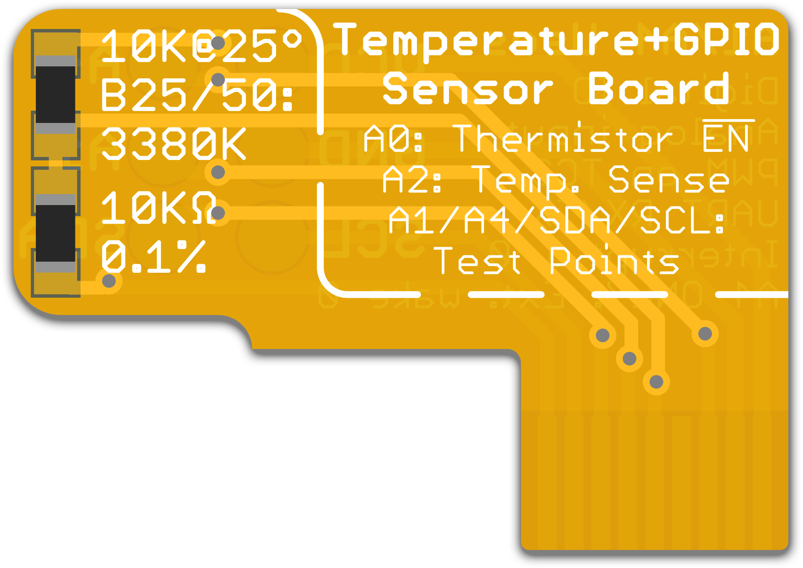

Sensor Watch Accessory Board: Temperarure + GPIO
================================================

This sensor board shipped (or will ship) to all Sensor Watch Crowd Supply backers. It is also available for separate purchase at the Sensor Watch page on Crowd Supply.

Temperature
-----------

The Temperature and GPIO board includes two passive components on the front, a very precise 10 kΩ resistor and a 10 kΩ thermistor, that together form a voltage divider. While the resistance of the 10 kΩ resistor stays very close to 10 kΩ at all temperatures, the thermistor's resistance goes down as the temperature rises, and goes up as the temperature falls. This changes the voltage that's measured at the middle of the voltage divider, and with some clever math, we can turn that voltage into a very precise temperature reading.

While the watch library's thermistor driver is preconfigured with all required parameters for this calculation, we'll repeat them here for completeness: 

* The resistor has a value of 10 kilo-ohms with a tolerance of 0.1%
* The thermistor has a nominal value of 10 kilo-ohms at 25° C, and a B coefficient of 3380K

GPIO
----

In addition, this sensor board breaks out test points on the underside for six nets: power and ground, the I2C pins SDA and SCL, as well as two GPIO pins, A1 and A4. It will be fiddly, but you can solder fine enamel wires to these test points to connect other kinds of gadgets to your Sensor Watch, whether to test out possibilities for future sensor boards or to bodge in a device with additional functions you want.

**Note that if you solder to these test pads, you must cover the five test points on the Sensor Watch board with tape!** It's possible for the solder bumps you create on the underside of the sensor board to touch the main Sensor Watch board, so you must electrically isolate them with tape.

The A1 and A4 pins are very versatile. You can use these two pins as:

* General purpose digital IO to drive a low current device like a sensor or LED
* Analog inputs to read an analog value from a circuit like a phototransistor
* PWM output (they are both on the same TC3 peripheral)
* Input to the TC3 counter peripheral for frequency measurement
* UART transmit (A4) and receive (A1)
* External interrupt inputs

In addition, you can use pin A4 as an external wake interrupt, which can wake the watch from the ultra-low-power BACKUP mode.
